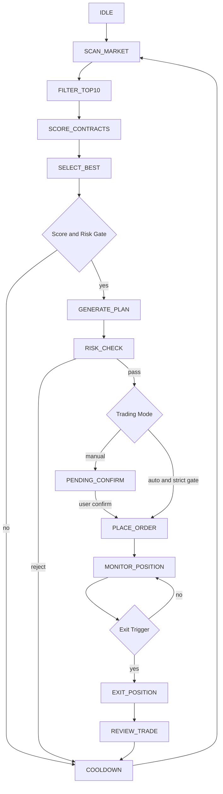

# OKX Contract Agent Loop Design

## 1. System Goal

Build a production-oriented OKX USDT perpetual trading agent loop:

- Scan market with live OKX data.
- Filter high-liquidity contracts into Top 10 candidates.
- Score every candidate with explainable multi-factor rules.
- Generate a structured trade plan with AI as an assistant, not the final authority.
- Run independent risk checks before any order.
- Support manual-confirm mode by default.
- Allow auto-trade mode only behind explicit configuration and stricter gates.
- Monitor positions after order submission.
- Exit by stop loss, staged take profit, timeout, risk exit, or manual intervention.
- Review every completed trade and feed metrics back into risk controls.

Core principle: risk control has higher priority than AI, score, or execution.

## 2. Current System Gap

Current project already has:

- OKX ticker/candle/funding/open-interest adapters.
- Rule-based contract candidate scoring.
- AI trade-plan generation.
- Pending order manual confirmation.
- OKX private order submission.
- Account balance and positions query.
- Basic risk checks.
- Frontend pages for candidates, pending orders, account and system control.

Missing for the requested production loop:

- State machine and persistent loop state.
- Persistent candidate scores, trade plans, orders, fills and reviews.
- Depth/spread/slippage checks.
- BTC/ETH market environment model.
- Multi-timeframe indicator engine.
- Detailed factor score breakdown.
- Structured AI output schema validation.
- Position monitor and exit engine.
- Staged take-profit orders.
- Backtest engine and parameter comparison.
- Daily loss, consecutive-loss and cooldown enforcement.
- Restart recovery for open positions and pending orders.
- Audit log for every decision.

## 3. Workflow



## 4. Main Modules

### StrategyLoopRunner

Owns the state machine and loop scheduling.

Responsibilities:

- Run scan loop every configured interval.
- Prevent overlapping loops.
- Enforce cooldown after trade exit or risk rejection.
- Resume state after restart.
- Persist every state transition.

### MarketScanner

Fetches live OKX data.

Responsibilities:

- Load SWAP tickers.
- Filter USDT perpetuals.
- Fetch K lines for 5m, 15m, 20m synthetic, 1H.
- Fetch funding rate.
- Fetch open interest.
- Fetch order book depth.
- Fetch BTC/ETH environment data.
- Record data timestamps and reject stale or missing data.

### CandidateFilter

Builds a liquid and tradeable Top 10 candidate set.

Hard filters:

- 24h quote volume >= configured threshold, default 50,000,000 USDT.
- Spread <= configured threshold.
- Depth at configurable bps >= minimum notional.
- Funding rate not extreme.
- K-line data complete.
- No extreme wick or unstable newly listed contract.
- No API/data anomaly.

Soft ranking signals:

- 20m trend clarity.
- 5m momentum.
- 1h alignment.
- Volume expansion.
- OI change.
- ATR expansion.
- Price breakout or pullback structure.

### IndicatorCalculator

Calculates deterministic indicators.

Indicators:

- EMA20, EMA50, EMA200.
- RSI14.
- MACD.
- Bollinger Bands.
- ATR14.
- Volume spike ratio.
- High/low structure over last 20 bars.
- 5m, 15m, 20m, 1h returns.
- Wick ratio and abnormal candle detection.
- Support/resistance levels.

### ScoreEngine

Produces a 100-point explainable score.

Output must include:

- Total score.
- Factor breakdown.
- Recommended direction.
- Trade allowed flag.
- Deny reasons.
- Candidate ranking.

### NewsRiskChecker

Checks risk events.

Sources can start as adapters:

- Exchange announcement adapter.
- News search adapter.
- Project event adapter.
- Manual blocklist.

High news risk must reject trade even when technical score is high.

### LeverageCalculator

Calculates dynamic leverage.

Inputs:

- Total score.
- Trend score.
- ATR volatility.
- Stop-loss distance.
- Spread/depth/slippage.
- Funding crowding.
- Contract class, e.g. BTC/ETH vs altcoin.
- Configured max leverage.

Rules:

- Default low leverage.
- Reduce leverage for high ATR, wick risk, poor liquidity, extreme funding.
- Never exceed configured max leverage.
- Never exceed account-level risk cap.

### PositionSizer

Calculates position from risk, not feeling.

Formula:

```text
single_risk_usdt = account_equity * single_trade_risk_percent
stop_loss_percent = abs(entry_price - stop_loss) / entry_price
position_notional = single_risk_usdt / stop_loss_percent
margin_required = position_notional / leverage
```

User manual confirmation amount is treated as margin. If user inputs a margin lower than recommended, position is reduced. If user inputs above risk limit, reject.

### TradePlanner

Creates executable trade plan.

Includes:

- Direction.
- Entry type: market, limit, breakout, pullback.
- Entry price and entry zone.
- Leverage.
- Position notional.
- Margin required.
- Stop loss.
- TP1/TP2/TP3.
- Move-stop rule.
- Timeout.
- Reason list and risk list.

### RiskManager

Independent authority. It can veto every trade.

Hard rules:

- Single-trade max loss.
- Daily max loss.
- Max daily trade count.
- Consecutive losses cooldown.
- No high-correlation multi-position exposure.
- No trade on stale data.
- No trade on high latency.
- No trade if slippage is above threshold.
- No trade if stop loss is unclear.
- No trade if risk/reward is below threshold.
- No trade if score threshold is not met.
- No trade during high market or news risk.

### OrderExecutor

Submits and manages OKX orders.

Responsibilities:

- Set leverage before order when required.
- Place entry order.
- Handle market/limit/post-only behavior.
- Handle reduce-only exit orders.
- Place staged take-profit orders.
- Place stop-loss or algo order.
- Record OKX ordId, clOrdId, state, fills and errors.
- Prevent duplicate order submission by idempotency key.

### PositionMonitor

Monitors open positions.

Checks:

- Current PnL.
- Stop loss proximity.
- TP hits.
- Volume decay.
- Reverse volume spike.
- BTC/ETH reversal.
- News risk changes.
- Order book deterioration.
- Funding changes.
- Timeout.

### TradeReviewEngine

Reviews every completed trade.

Calculates:

- Realized PnL.
- R multiple.
- Slippage.
- Hold duration.
- Win/loss.
- Whether entry matched original plan.
- Whether exit matched plan.
- AI score vs actual result.
- Strategy improvement notes.

### BacktestEngine

Runs before enabling auto trading.

Capabilities:

- Replay 3-6 months K-line data.
- Compare score thresholds: 70, 75, 80, 85.
- Compare max leverage: 2x, 3x, 5x.
- Compare stop loss methods.
- Compare staged take-profit rules.
- Report win rate, return, max drawdown, Sharpe ratio and average R.

## 5. Scoring Model

Total: 100 points.

### Trend Score: 25

Inputs:

- 20m trend direction.
- 1h trend alignment.
- EMA20/EMA50/EMA200 alignment.
- Breakout from recent range.
- Higher highs and higher lows for long.
- Lower highs and lower lows for short.

Reject if direction is unclear.

### Volume Score: 20

Inputs:

- Current volume vs last 20 bars average.
- Breakout with volume.
- Pullback volume shrink.
- Abnormal high volume with no price movement.

### Volatility Score: 15

Inputs:

- ATR expansion.
- Bollinger band expansion.
- Low-volatility to high-volatility transition.
- Wick frequency.

High volatility is not automatically good. Excessive wick risk reduces score.

### Liquidity Score: 10

Inputs:

- Bid/ask spread.
- Depth at configured bps.
- Estimated slippage.
- Order book wall distribution.

### OI and Funding Score: 10

Inputs:

- OI direction.
- Price and OI relationship.
- Funding crowding.

Long example:

- Price up + OI up: positive.
- Price up + OI down: cautious, possible short covering.
- Funding too high: reduce score.

Short example:

- Price down + OI up: positive.
- Funding too negative: reduce score.

### Market Environment Score: 10

Inputs:

- BTC 20m and 1h trend.
- ETH 20m and 1h trend.
- Market volatility.
- Major support/resistance proximity.

### Risk Event Score: 10

Inputs:

- News risk.
- Exchange announcements.
- Unlock events.
- Security/regulatory incidents.
- Macro events.

High risk must reject trade.

## 6. Trade Signal Gates

Trade plan can be generated only when:

- Total score >= 75.
- Trend score >= 18.
- Volume score >= 14.
- Liquidity score >= 7.
- Risk event score >= 7.
- Market environment does not conflict.
- Risk/reward >= 1.5, preferably >= 2.
- Stop loss is structure-based and valid.
- No conflicting position.
- System risk is normal.

Auto trade requires stricter gates:

- Total score >= 80.
- Risk/reward >= 2.
- News risk low.
- Liquidity good.
- Stop loss clear.
- No consecutive-loss risk.
- Auto mode explicitly enabled.
- Backtest gate passed.

Default mode must remain manual-confirm.

## 7. Leverage Rules

Base leverage by score:

- 75-80: 2x-3x.
- 80-85: 3x-4x.
- 85-90: 4x-5x.
- 90+: 5x-10x only if volatility is low, liquidity is high and stop loss is clear.

Risk overrides:

- High ATR: reduce leverage.
- Frequent wick: reduce leverage.
- Funding crowded: reduce leverage.
- Altcoin: usually cap at 5x.
- BTC/ETH: can be higher but still risk-capped.
- Configured max leverage is absolute.

## 8. Stop Loss and Take Profit

Stop loss must combine:

- Market structure low/high.
- Support/resistance.
- ATR 1-1.5x.
- Failed breakout/failure point.

Do not use fixed percent as the only method.

Staged take profit:

- TP1: 1R, close 30%, move stop near breakeven.
- TP2: 2R, close 40%.
- TP3: 3R or key structure, close 30%.
- Strong trend: use trailing stop for remaining position.

Early exit:

- Volume decay.
- Reverse volume spike.
- Market reversal.
- News risk increases.
- Order book deterioration.
- Timeout.

## 9. State Machine

States:

- IDLE
- SCAN_MARKET
- FILTER_TOP10
- SCORE_CONTRACTS
- SELECT_BEST
- GENERATE_PLAN
- RISK_CHECK
- PENDING_CONFIRM
- PLACE_ORDER
- MONITOR_POSITION
- EXIT_POSITION
- REVIEW_TRADE
- COOLDOWN

Every state transition must be persisted.

## 10. Database Design

### contract_scan_run

- id
- status
- started_at
- finished_at
- message
- market_risk
- btc_trend
- eth_trend

### contract_candidate_score

- id
- scan_run_id
- inst_id
- direction
- total_score
- trend_score
- volume_score
- volatility_score
- liquidity_score
- oi_funding_score
- market_env_score
- news_risk_score
- allow_trade
- deny_reason
- reason_json
- risk_json
- raw_market_json
- created_at

### trade_plan

- id
- scan_run_id
- inst_id
- direction
- entry_type
- entry_price
- entry_zone_low
- entry_zone_high
- leverage
- position_notional
- margin_required
- stop_loss
- risk_reward_ratio
- max_loss_usdt
- max_loss_percent
- allow_trade
- deny_reason
- plan_json
- status
- created_at
- expire_at

### trade_take_profit_plan

- id
- trade_plan_id
- level
- price
- position_percent
- condition_text
- created_at

### trade_order

- id
- trade_plan_id
- inst_id
- side
- pos_side
- ord_type
- td_mode
- size
- price
- reduce_only
- cl_ord_id
- okx_ord_id
- okx_state
- status
- error_message
- created_at
- updated_at

### position_monitor_snapshot

- id
- trade_plan_id
- inst_id
- pos_side
- position_size
- avg_price
- mark_price
- upl
- upl_ratio
- market_risk
- exit_signal
- created_at

### trade_review

- id
- trade_plan_id
- inst_id
- entry_price
- exit_price
- realized_pnl
- realized_r
- max_drawdown
- hold_seconds
- exit_reason
- strategy_followed
- ai_error
- review_json
- created_at

### risk_daily_stat

- id
- trade_date
- equity_start
- equity_end
- realized_pnl
- daily_loss_percent
- trade_count
- consecutive_losses
- risk_mode
- created_at

### audit_log

- id
- event_type
- entity_type
- entity_id
- level
- message
- payload_json
- created_at

## 11. Core Pseudocode

```java
void runLoop() {
    if (riskManager.systemBlocked()) {
        scheduler.nextScanAfter(Duration.ofMinutes(30));
        return;
    }

    ScanRun run = audit.startScan();
    MarketSnapshot snapshot = marketScanner.scanLive();
    List<Candidate> top10 = candidateFilter.filterTop10(snapshot);
    List<ScoreResult> scores = scoreEngine.score(top10, snapshot.marketContext());
    Optional<ScoreResult> best = selector.bestTradable(scores);

    if (best.isEmpty()) {
        audit.noTrade("当前没有高质量交易机会，继续等待。");
        cooldown.normal();
        return;
    }

    TradePlan plan = tradePlanner.generate(best.get(), snapshot);
    RiskDecision risk = riskManager.check(plan);
    if (!risk.passed()) {
        audit.riskRejected(plan, risk);
        cooldown.normal();
        return;
    }

    if (config.manualConfirm()) {
        pendingOrderService.create(plan);
        return;
    }

    if (!risk.autoTradeAllowed(plan)) {
        pendingOrderService.create(plan);
        return;
    }

    OrderResult result = orderExecutor.placeEntryAndProtection(plan);
    positionMonitor.watch(result.positionKey());
}
```

## 12. Java/Spring Boot Implementation Recommendation

Recommended packages:

- `com.example.quant.agent`
- `com.example.quant.agent.state`
- `com.example.quant.agent.scan`
- `com.example.quant.agent.indicator`
- `com.example.quant.agent.score`
- `com.example.quant.agent.plan`
- `com.example.quant.agent.risk`
- `com.example.quant.agent.execution`
- `com.example.quant.agent.monitor`
- `com.example.quant.agent.review`
- `com.example.quant.agent.backtest`
- `com.example.quant.agent.audit`

Implementation sequence:

1. Persist scan, score, plan, order and audit tables.
2. Split current `OkxContractScanner` into scanner, filter, indicator and score modules.
3. Add score breakdown DTO.
4. Add depth/spread/slippage adapter.
5. Add BTC/ETH market environment module.
6. Add risk manager gates.
7. Add structured AI output schema validation.
8. Add position monitor.
9. Add staged exit execution.
10. Add backtest engine.
11. Add frontend loop dashboard.

## 13. OKX API Integration

Market data:

- `/api/v5/market/tickers?instType=SWAP`
- `/api/v5/market/candles`
- `/api/v5/market/books`
- `/api/v5/public/funding-rate`
- `/api/v5/public/open-interest`

Account and trade:

- `/api/v5/account/balance`
- `/api/v5/account/positions`
- `/api/v5/account/set-leverage`
- `/api/v5/trade/order`
- `/api/v5/trade/cancel-order`
- `/api/v5/trade/orders-pending`
- `/api/v5/trade/fills`
- Algo order APIs for stop loss and take profit if enabled.

Required safeguards:

- Idempotent `clOrdId`.
- Timeout and retry policy.
- Time sync.
- Explicit logging of request intent without secrets.
- Never log API secret or passphrase.
- Detect partial fills.
- Recover open orders after restart.

## 14. Config Items

```yaml
quant:
  agent:
    enabled: false
    mode: MANUAL_CONFIRM
    scan-interval-seconds: 300
    risk-block-scan-interval-seconds: 1800
    top-candidate-limit: 10
    auto-trade:
      enabled: false
      min-score: 80
      min-risk-reward: 2
      require-backtest-pass: true
    score:
      min-total-score: 75
      min-trend-score: 18
      min-volume-score: 14
      min-liquidity-score: 7
      min-news-risk-score: 7
    market:
      min-volume-24h-usdt: 50000000
      max-spread-bps: 8
      min-depth-usdt: 100000
      max-funding-abs: 0.0015
      max-wick-ratio: 0.55
      stale-data-seconds: 20
    risk:
      single-trade-risk-percent: 1
      max-single-loss-percent: 5
      max-daily-loss-percent: 30
      max-daily-trades: 5
      max-consecutive-losses: 3
      cooldown-minutes-after-loss: 30
      max-leverage: 5
    monitor:
      interval-seconds: 10
      max-hold-minutes: 120
```

## 15. Frontend Pages

### Agent Dashboard

- Current loop state.
- Last scan time.
- Current market status.
- BTC/ETH trend.
- Current risk mode.
- Auto-trade switch, disabled by default.
- Emergency stop.

### Candidate Score Board

- Top 10 table.
- Factor score columns.
- Direction.
- Allow trade.
- Deny reason.
- Data timestamp.

### Trade Plan Review

- AI plan.
- Rule score.
- Risk check.
- Recommended margin.
- User margin input.
- Staged TP/SL view.
- Confirm button.

### Position Monitor

- Open position.
- PnL.
- TP/SL progress.
- Exit conditions.
- Manual close button.

### Review Center

- Completed trades.
- Win rate.
- Average R.
- Max drawdown.
- AI score vs result.
- Strategy notes.

### Backtest Page

- Time range.
- Score threshold comparison.
- Leverage cap comparison.
- Metrics table.
- Equity curve.

## 16. Development Task List

### Phase 1: Foundation

- Add persistent tables and repositories.
- Add audit logger.
- Add scan run and candidate score persistence.
- Refactor current contract scanner into scanner/filter/indicator/score modules.
- Add live data timestamps.
- Add score breakdown DTO.

### Phase 2: Risk and Plan

- Add market environment module for BTC/ETH.
- Add depth/spread/slippage checks.
- Add dynamic leverage calculator.
- Add position sizer.
- Add structured trade plan schema.
- Add stricter risk manager gates.

### Phase 3: Execution

- Add idempotent order submission.
- Set leverage before order.
- Add submitted/fill/open-position state tracking.
- Add stop-loss and staged take-profit order support.
- Add error recovery for failed/partial orders.

### Phase 4: Position Monitor

- Add scheduled position monitor.
- Add exit signal engine.
- Add reduce-only exit orders.
- Add timeout exit.
- Add risk exit.
- Add restart recovery.

### Phase 5: Review and Backtest

- Add trade review persistence.
- Add statistics service.
- Add historical data importer.
- Add backtest runner.
- Add threshold/leverage comparison reports.

### Phase 6: Frontend

- Agent dashboard.
- Top 10 score board.
- Trade plan review page.
- Position monitor page.
- Review center.
- Backtest page.

## 17. Immediate Changes Recommended For Current System

The current system should not enable automatic loop trading yet.

Immediate safe changes:

- Keep manual-confirm mode as default.
- Keep contract candidate data live, not cached.
- Treat user input as margin, not entry price.
- Log every confirm, risk decision and OKX order submission.
- Show submitted order id after OKX accepts order.
- Add score breakdown before auto trading.
- Add depth/spread check before order.
- Add position monitor before auto trading.
- Add persistent order state before auto trading.

Auto trading should remain disabled until backtest and monitor modules exist.

## 18. 2026-06-18 真实交易闭环第一阶段

本次改造把自动交易从“提交 OKX 委托”推进到可恢复、可追踪、可复盘的第一阶段闭环。核心边界如下：

- 自动交易运行态持久化到 `system_control_state`，包括紧急停止、自动交易开关、owner、风险模式、总预算、无风控最低分数和最低杠杆。
- 自动交易预算持久化到 `auto_trade_budget_reservation`，`RESERVED` 表示未成交入场委托或待确认占用，`USED` 表示已进入实际入场风险敞口，`RELEASED` 表示预算释放。
- OKX 提交超时后通过稳定 `clOrdId` 查询 `/api/v5/trade/order`，查到订单则恢复本地 `SUBMITTED` 并保持预算占用；确认查不到时才释放预算。
- `AutoTradeRecoveryTask` 增强为恢复和同步入口：处理过期/失败预算释放、`UNKNOWN_SUBMIT_STATUS` 恢复，并调用生命周期检查。
- 平仓请求写入 `close_position_record`，初始状态为 `CLOSE_SUBMITTED`，后续由同步任务确认最终 `CLOSED` 和预算释放。
- 当前 OKX 普通委托和算法保护单通过 `/api/quant/okx/orders/current`、`/api/quant/okx/orders/algo` 暴露给前端。
- 自动交易复盘记录不再只保存 `EXECUTED`，也保存 `SKIPPED`、`REJECTED`、`FAILED`、`UNKNOWN_SUBMIT_STATUS` 等状态及 `reasonCode`、`stage`、`fallbackAllowed`。
- NO_RISK 仍保留交易所级硬门槛，极端 spread 会被拒绝，不再绕过。

### 生命周期处理

新增 `quant.agent.lifecycle` 配置：

```yaml
quant:
  agent:
    lifecycle:
      entry-timeout-minutes: 10
      sideways-position-hours: 3
      sideways-pnl-range-pct: 1
      sideways-exit-profit-pct: 0.3
      max-hold-hours: 8
      max-hold-action: CLOSE_POSITION
      sideways-action: TIGHTEN_TAKE_PROFIT
      move-stop-to-breakeven: false
```

生命周期同步行为：

- 入场委托超过 10 分钟仍完全未成交：撤销 OKX 入场委托，标记 `ENTRY_TIMEOUT_CANCELLED`，释放预算。
- 入场委托部分成交：撤销剩余未成交部分，按实际 `avgPx` 和 `filledSize` 提交 reduceOnly 止损和 TP1/TP2/TP3 保护单，并保持预算为 `USED`。
- 自动交易持仓超过 3 小时且浮盈亏在 -1% 到 +1%：标记 `SIDEWAYS_TIMEOUT_TP_ADJUSTED`，提交小盈利退出 TP；多单 TP 高于均价，空单 TP 低于均价。
- 自动交易持仓超过 8 小时：提交 OKX close-position，状态变为 `CLOSE_SUBMITTED`；若提交失败则进入 `EMERGENCY_ATTENTION_REQUIRED`。

### 前端展示

新增或增强页面：

- “自动交易复盘”：显示所有状态、阶段、原因和 fallback 信息。
- “交易生命周期”：显示 `instId`、`posSide`、入场状态、保护单状态、持仓时长、浮盈亏、预算占用、生命周期状态和下一步动作。
- “当前委托/保护单”：分开展示 OKX 当前普通委托和算法保护单，保护单标识为 STOP_LOSS/TP。
- “平仓记录”：显示每次平仓请求的 `CLOSE_SUBMITTED` 等状态。
- 控制台资产支持 USD/RMB 显示切换；当前前端使用固定 7.2 汇率作为展示回退，交易逻辑仍使用 USDT。

### 剩余边界

- 当前已预留成交、手续费、资金费字段，但完整净收益仍需接入 OKX 成交流水、手续费流水和资金费流水后计算。
- 平仓 `CLOSED` 的最终确认已支持基于 OKX 当前持仓归零的本地同步；后续仍需接入 OKX close order/fill 明细来补全 `avgPx`、手续费、资金费和精确已实现盈亏。
- 保护单在平仓完成后会本地标记 `INVALID`，后续仍需增加 OKX 算法单批量撤销确认和失败重试。

## 19. 2026-06-18 第二阶段闭环补强

本次补强聚焦第一阶段剩余的恢复和账号安全缺口：

- `PendingOrder` 新增 `pending_order_state` 表持久化，自动交易入场订单、预算预占用、`clientOrderId`、OKX 订单号、提交时间、拒绝原因和生命周期状态会在状态变化时保存。
- `PendingOrderService` 启动时恢复未闭环订单，`SUBMITTED`、`UNKNOWN_SUBMIT_STATUS`、`PROTECTION_SUBMITTED`、`CLOSE_SUBMITTED` 等状态可继续被恢复任务和生命周期任务处理。
- 开启自动交易前，`SystemControlController` 必须调用 OKX 私有账户验证；未绑定、签名失败、权限/IP/时间戳等验证失败时不会打开自动交易开关。
- 新增 `ClosePositionRecoveryService`，定时任务确认 OKX 当前持仓已归零后，将平仓记录标记为 `CLOSED`，对应本地 PendingOrder 标记为 `CLOSED`，释放自动交易预算，并将 reduceOnly 保护单本地标记为 `INVALID`。
- 登录页移除默认管理员账号/密码提示和用户名预填；账号安全页创建用户输入区加宽，并支持查看初始密码。

### 第二阶段剩余边界

- OKX 算法单撤销目前是本地失效标记，仍需对接 `/api/v5/trade/cancel-algos` 做实盘撤销确认。
- 平仓完成后的精确收益仍需 OKX 成交流水、手续费流水和资金费流水。
- 自动交易扫描容量判断已能利用本地恢复订单和预算记录，但还需要继续把 OKX 当前普通委托/算法委托状态同步回 `trade_order` 的最终状态。

## Change Log

### 2026-06-18 - 自动交易闭环第二阶段补强

- 变更摘要：补齐 PendingOrder 持久化恢复、开启自动交易前 OKX Key 验证、平仓完成同步释放预算和保护单本地失效。
- 影响文件：`src/main/java/com/example/quant/order/PendingOrder.java`、`src/main/java/com/example/quant/order/PendingOrderService.java`、`src/main/java/com/example/quant/order/PendingOrderEntity.java`、`src/main/java/com/example/quant/order/PendingOrderRepository.java`、`src/main/java/com/example/quant/controller/SystemControlController.java`、`src/main/java/com/example/quant/account/ClosePositionRecoveryService.java`、`src/main/java/com/example/quant/task/AutoTradeRecoveryTask.java`、`src/main/resources/db/migration/V12__pending_order_state.sql`、`frontend/src/pages/LoginPage.tsx`、`frontend/src/pages/SecurityPage.tsx`。
- 影响：服务重启后未闭环 PendingOrder 可恢复；自动交易开关不会在 OKX 私有接口验证失败时打开；平仓确认后释放预算并将本地保护单标记为 `INVALID`；登录页不再暴露默认管理员。
- 验证：`mvn test` 通过，162 个测试 0 失败；`npm --prefix frontend run build` 通过并有 Vite chunk size 警告。

### 2026-06-18 - 登录与账号安全前端优化

- 变更摘要：登录页移除默认管理员账号/密码提示和用户名预填；账号安全页创建用户表单改为更宽输入区，并支持初始密码显示/隐藏。
- 影响文件：`frontend/src/pages/LoginPage.tsx`、`frontend/src/pages/SecurityPage.tsx`。
- 影响：登录页不再暴露 `admin / admin123`；管理员创建新用户时用户名和密码输入框更宽，长账号或长密码可正常查看。
- 验证：`npm --prefix frontend run build` 通过，仍有 Vite chunk size 警告。

### 2026-06-18 - 自动交易真实闭环第一阶段

- 变更摘要：新增运行态/预算持久化、OKX clOrdId 超时恢复、平仓记录、当前委托/保护单接口、自动交易复盘原因、生命周期超时处理和前端展示入口。
- 影响文件：`src/main/java/com/example/quant/system/SystemControlService.java`、`src/main/java/com/example/quant/agent/budget/AutoTradeBudgetService.java`、`src/main/java/com/example/quant/okxtrade/OkxTradeAdapter.java`、`src/main/java/com/example/quant/task/AutoTradeRecoveryTask.java`、`src/main/java/com/example/quant/agent/lifecycle/AutoTradeLifecycleService.java`、`src/main/java/com/example/quant/account/PositionCloseService.java`、`src/main/resources/db/migration/V11__auto_trade_real_loop_phase1.sql`、`frontend/src/pages/CurrentOkxOrderList.tsx`、`frontend/src/pages/ClosePositionRecordList.tsx`、`frontend/src/pages/AutoTradeLifecycleList.tsx`、`frontend/src/pages/AutoTradeRecordList.tsx`、`frontend/src/pages/Dashboard.tsx`。
- 影响：新增数据库表 `system_control_state`、`auto_trade_budget_reservation`、`close_position_record`；新增 OKX 当前委托/算法委托接口；新增生命周期状态 `ENTRY_TIMEOUT_CANCELLED`、`SIDEWAYS_TIMEOUT_TP_ADJUSTED`、`MAX_HOLD_TIMEOUT`、`CLOSE_SUBMITTED`；NO_RISK 保留极端 spread 硬拦截。
- 验证：`mvn test -Dtest=SystemControlServiceTest,AutoTradeBudgetServiceTest,OkxTradeAdapterTest,AutoTradeRecoveryTaskTest,AutoTradeRecordServiceTest,PositionCloseServiceTest,OkxCurrentOrderServiceTest,AutoTradeLifecycleServiceTest,OrderConfirmServiceTest` 通过；`npm --prefix frontend run build` 通过并有 Vite chunk size 警告。
